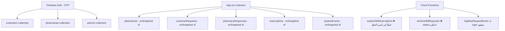
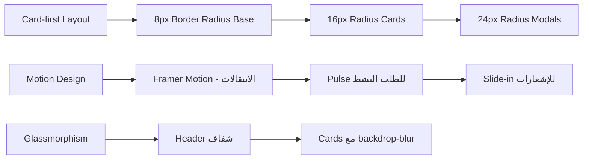

# تقييم شامل لمشروع WenHoBoh 🏥

## نظرة عامة على المشروع

**WenHoBoh** منصة صيدلة رقمية تستهدف مدينة عنيزة، المملكة العربية السعودية. تتيح للعملاء البحث عن الأدوية في الصيدليات القريبة بشكل فوري، مع لوحة تحكم للصيدليات ولوحة إدارة مركزية. المشروع مبني على React 19 + TypeScript + Firebase + Tailwind CSS v4.

---

## ✅ أولاً: حالة الملفات - الباك-آب مقابل النسخة الحالية

**النتيجة:** لا توجد ملفات مفقودة. النسختان **متطابقتان تماماً** في المحتوى — الفرق الوحيد هو نوع نهايات الأسطر (CRLF في WenHoBoh، LF في Backup). الملفات في WenHoBoh هي الأحدث والأكثر اكتمالاً. **لا يلزم نسخ أي شيء من Backup.**

---

## 💪 نقاط القوة

### 1. بنية المشروع
- **Stack حديثة ومتسقة:** React 19، TypeScript، Tailwind v4، Vite 6، Firebase 12 — أحدث الإصدارات
- **تصميم متعدد اللغات:** دعم كامل للعربية والإنجليزية عبر prop `lang` في كل مكون
- **ثلاثة بوابات واضحة:** العميل، الصيدلية، الإدارة — فصل واضح للمسؤوليات
- **Firebase Rules:** قواعد Firestore موضوعة ومصممة بعناية لكل collection
- **Cloud Functions:** 3 وظائف مجدولة للصلاحية والأرشفة والتدقيق
- **خريطة تفاعلية:** دمج Google Maps مع fallback SVG عند غياب المفتاح
- **Error Boundary:** معالجة أخطاء React على مستوى التطبيق
- **RecaptchaVerifier:** حماية من الـ spam في المصادقة عبر OTP

### 2. جودة الكود
- استخدام TypeScript بشكل واسع مع تعريفات types واضحة
- الـ hooks مرتبة ومنظمة
- Real-time listeners عبر `onSnapshot` لتحديثات لحظية
- المنطق الرئيسي مركّز في `App.tsx` مع props واضحة للمكونات الأبناء

---

## ⚠️ نقاط الضعف والمشاكل

### 🔴 حرجة (يجب إصلاحها قبل الإطلاق)

| # | المشكلة | الموقع | التأثير |
|---|---|---|---|
| 1 | **رقم هاتف المدير مضمّن في الكود:** `+966501511643` مرئي في الـ bundle | `ProtectedRoute.tsx:18`, `AuthPage.tsx:70,128` | أمني: أي شخص يفحص الكود يعرف رقم المدير |
| 2 | **Cloud Function تستعلم عن حقل خاطئ:** `expireOldReservations` تبحث عن `createdAt` لكن المستند يحتوي `reservedAt` | `functions/src/index.ts:18` | وظيفي: انتهاء الحجوزات لا يعمل أبداً |
| 3 | **حالة `'archived'` غير معرّفة في النوع:** `archiveOldRequests` تكتب `status:'archived'` غير موجودة في `CustomerRequest.status` | `functions/src/index.ts:71` | وظيفي: TypeScript error + runtime inconsistency |
| 4 | **رفع صورة الترخيص وهمي:** الكود يحفظ رابط Unsplash ثابت بدلاً من رفع حقيقي | `PharmacyPortal.tsx:164` | وظيفي: لا يمكن التحقق من تراخيص الصيدليات |
| 5 | **`wipeFirestoreData()` بدون تحقق سيرفر:** حذف قاعدة البيانات بالكامل يعتمد على حماية client-side فقط | `firebase.ts:227` | أمني: خطر هجوم |

### 🟡 متوسطة (تؤثر على الجودة والكفاءة)

| # | المشكلة | الموقع |
|---|---|---|
| 6 | **`listenToResponses` بدون فلتر:** كل العملاء يرون ردود كل الصيدليات على كل الطلبات | `firebase.ts:113` |
| 7 | **Listeners مكررة:** `customerRequests` و`reservations` مسموع لهما مرتين (App.tsx + AdminPortal.tsx) | كلا الملفين |
| 8 | **نمط طلب واحد عالمي:** `listenToActiveRequest` يتتبع طلب واحد فقط — لا يدعم عدة عملاء متزامنين | `firebase.ts:96` |
| 9 | **مساران لتسجيل الصيدلية:** `AuthPage.tsx` و`PharmacyPortal.tsx` يسجلان بيانات مختلفة ومتعارضة | كلا الملفين |
| 10 | **عداد الحجز لا يحسب من `expiresAt`:** العداد يبدأ من 1800 ثانية دائماً بدلاً من الوقت الفعلي المتبقي | `CustomerPortal.tsx` |
| 11 | **`handleSetPharmacies` تكتب كل الصيدليات:** أي تحديث يُنشئ write لكل صيدلية — عمليات Firestore زائدة | `App.tsx` |

### 🟢 منخفضة (تحسينات مطلوبة)

| # | المشكلة | الموقع |
|---|---|---|
| 12 | كود ميت: `signUpWithEmail`, `linkPhoneToEmail` وغيرها غير مستخدمة | `authService.ts` |
| 13 | أدوار غير مستخدمة: `'splitscreen'` و`'gateway'` في `Role` type | `types.ts` |
| 14 | `ErrorBoundary` بالإنجليزية فقط | `ErrorBoundary.tsx` |
| 15 | `notifications` في CustomerPortal غير محفوظة (تضيع عند الريفريش) | `CustomerPortal.tsx` |
| 16 | **باب خلفي سري:** 5 نقرات على الشعار تنقل لصفحة المدير | `Layout.tsx:17-27` |
| 17 | `logNewRequestEvent` يكتب نوع `'request_created_audit'` غير موجود في `SystemEvent.type` | `functions/src/index.ts:96` |

---

## 🔗 تقييم الربط بقاعدة البيانات

### Collections المستخدمة وحالتها



| Collection | القراءة | الكتابة | Real-time | الحالة |
|---|---|---|---|---|
| `pharmacies` | ✅ | ✅ | ✅ | يعمل |
| `customerRequests` | ✅ | ✅ | ✅ | يعمل (بحدود) |
| `pharmacyResponses` | ✅ | ✅ | ✅ | بدون فلتر |
| `reservations` | ✅ | ✅ | ✅ | يعمل |
| `systemEvents` | ✅ | ✅ | ✅ | type mismatch |
| `customers` | ✅ | ✅ | ❌ | بدون listener |
| `admins` | ✅ | ✅ | ❌ | بدون listener |

**المصادقة:** Firebase Phone OTP ✅ — تعمل بشكل كامل  
**Cloud Functions:** مجدولة ✅ لكن بها أخطاء منطقية ❌

---

## 🎨 تصور تصميم واجهة المستخدم العصرية

### الهوية البصرية المقترحة — **WenHoBoh Brand System**

```
الاسم: وين هو بوه | WenHoBoh
الشعار: رمز "W" مدمج مع إشارة موقع دائرية
الشعار الفرعي: "كل اللي تحتاجه من الصيدلية، قريب منك" | "Your Medicine, Nearby"
```

### 🎨 لوحة الألوان الرئيسية

```
الأساسي (Primary):
  • Teal Deep:    #0D6E6E  — ثقة طبية، عمق
  • Teal Bright:  #14B8B8  — نشاط، تفاعل

الثانوي (Secondary):
  • Amber Gold:   #F59E0B  — طاقة، سرعة التوصيل
  • Amber Light:  #FEF3C7  — خلفيات دافئة

المحايد (Neutral):
  • Slate 950:    #0A0F1E  — النصوص الداكنة
  • Slate 100:    #F1F5F9  — خلفية عامة
  • White:        #FFFFFF  — بطاقات

الحالات (Status):
  • Success:      #10B981  — متاح
  • Warning:      #F59E0B  — قيد المعالجة
  • Danger:       #EF4444  — غير متاح / انتهى
```

### 🖋️ الخطوط المقترحة

```
العربي:  IBM Plex Sans Arabic — واضح، طبي، عصري
الإنجليزي: Inter Variable — نظيف، مقروء
```

### 📐 مبادئ التصميم



### 🏗️ هيكل الشاشات المقترح

#### صفحة العميل (Customer Portal)
```
┌─────────────────────────────────────┐
│  🔵 Header: Logo + لغة + خروج       │
├─────────────────────────────────────┤
│  ┌─────────────────────────────┐    │
│  │  🗺️ خريطة Google Maps       │    │
│  │  (نصف الشاشة العلوي)        │    │
│  │  ● دوائر التوسع المتحركة    │    │
│  └─────────────────────────────┘    │
│                                     │
│  ┌──────────┐ ┌──────────┐         │
│  │ 🏠 الرئيسية│ │🎫 طلبي  │         │
│  └──────────┘ └──────────┘         │
│                                     │
│  ┌─────────────────────────────┐    │
│  │  اسم الدواء ← اختر الفئة   │    │
│  │  ┌──┐┌──┐┌──┐┌──┐┌──┐     │    │
│  │  │💊││👶││💄││🌿││📱│     │    │
│  │  └──┘└──┘└──┘└──┘└──┘     │    │
│  │  نطاق البحث: ─●────  3km   │    │
│  │  [ 🔍 ابحث الآن ]           │    │
│  └─────────────────────────────┘    │
└─────────────────────────────────────┘
```

#### بطاقة رد الصيدلية (Response Card)
```
┌──────────────────────────────────────┐
│  🟢 صيدلية الشفاء                   │
│  ★★★★☆  4.2  •  200م منك           │
│  ──────────────────────────────────  │
│  ✅ متاح | السعر: 45 ريال           │
│  ⏱️ متوسط الرد: 3 دقائق             │
│  ──────────────────────────────────  │
│       [ 📌 احجز الآن ]               │
└──────────────────────────────────────┘
```

#### لوحة الصيدلية (Pharmacy Portal)
```
┌─────────────────────────────────────┐
│  Header: الصيدلية + حالة ●نشط       │
├─────────────────────────────────────┤
│  Stats: [طلبات اليوم] [معدل الرد]  │
├─────────────────────────────────────┤
│  🔔 طلب جديد (يومض)                │
│  ┌─────────────────────────────┐    │
│  │  دواء: باراسيتامول 500mg    │    │
│  │  فئة: OTC | صورة وصفة: لا  │    │
│  │  يقبل بديل: نعم             │    │
│  │  [ ✅ متاح ][ ❌ غير متاح ] │    │
│  │  [ 🔄 اقتراح بديل ]         │    │
│  └─────────────────────────────┘    │
└─────────────────────────────────────┘
```

---

## 📋 خطة الإصلاح المقترحة (مرتبة حسب الأولوية)

### المرحلة 1: إصلاح الأخطاء الحرجة

1. **إصلاح `expireOldReservations`:** تغيير `createdAt` إلى `reservedAt` في الاستعلام
2. **إصلاح `archiveOldRequests`:** إضافة `'archived'` إلى `CustomerRequest.status` في `types.ts`
3. **إصلاح `SystemEvent.type`:** إضافة `'request_created_audit'` و`'reservation_expired'` إلى النوع
4. **نقل رقم المدير:** إزالة الـ fallback المضمّن، إجبار استخدام `VITE_ADMIN_PHONE` env var فقط
5. **Firebase Storage:** استبدال Unsplash URL وهمي برفع حقيقي لصور التراخيص
6. **تأمين `wipeFirestoreData`:** إضافة تحقق بـ Firebase Admin SDK أو Cloud Function

### المرحلة 2: تحسينات الجودة والأداء

7. **فلترة `listenToResponses`:** إضافة `where('requestId', '==', activeRequestId)` 
8. **إزالة Listeners المكررة** في `AdminPortal.tsx` واستخدام props فقط
9. **دمج مسار تسجيل الصيدلية** في مكان واحد
10. **إصلاح عداد الحجز** ليحسب من `activeReservation.expiresAt`
11. **حذف الكود الميت** (`authService.ts` functions, dead roles)

### المرحلة 3: واجهة المستخدم العصرية

12. تطبيق لوحة الألوان الجديدة (Teal + Amber)
13. تحديث الخطوط إلى IBM Plex Sans Arabic
14. Glassmorphism header
15. تحسين بطاقات الردود والحجوزات
16. إضافة micro-animations بـ Framer Motion
17. تعريب `ErrorBoundary`

---

## 📊 تقييم عام

| المعيار | التقييم | ملاحظة |
|---|---|---|
| **بنية المشروع** | 8/10 | Stack ممتاز، تنظيم جيد |
| **جودة الكود** | 6/10 | أخطاء منطقية في Cloud Functions، كود ميت |
| **الأمان** | 5/10 | رقم مدير مكشوف، checks client-side فقط |
| **الربط بقاعدة البيانات** | 7/10 | يعمل جزئياً، أخطاء في Cloud Functions |
| **اكتمال الميزات** | 6/10 | رفع الصور وهمي، notifications غير محفوظة |
| **UI/UX** | 5/10 | يعمل لكن يحتاج تصميم احترافي |
| **الجاهزية للإطلاق** | 4/10 | يحتاج إصلاح حرج قبل Production |
